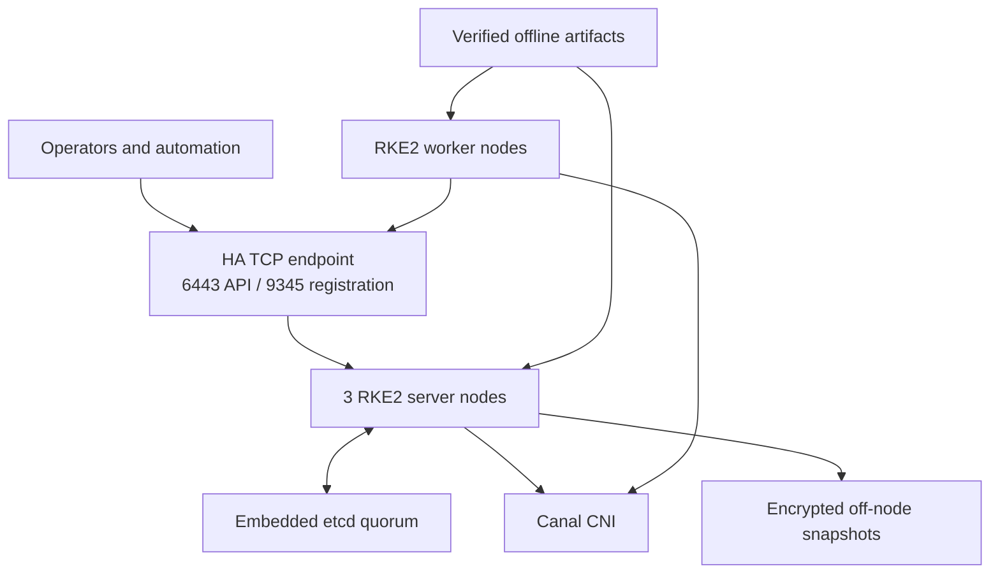
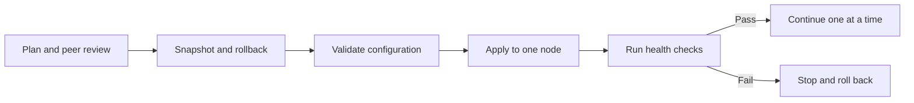
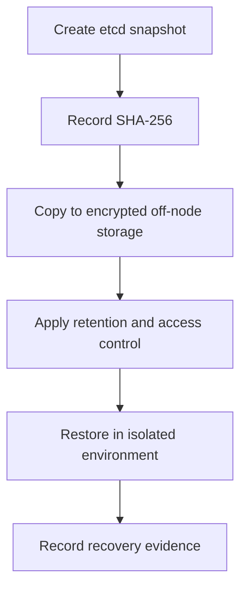

# Production-Style RKE2 HA Air-Gapped Cluster


A portfolio-safe reference implementation derived from hands-on operation of a nine-node RKE2 environment: three embedded-etcd control-plane nodes and six workers. It demonstrates high availability, offline installation, audit logging, metrics exposure, controlled upgrades, configuration validation, snapshot recovery, and security-conscious documentation without publishing company infrastructure.

> This is an educational reference, not a drop-in production environment. Replace every placeholder, review current RKE2 guidance, test in a non-production environment, and obtain peer approval before applying changes.

## 1. Project overview

This repository shows how to build and operate RKE2 when public registries are unavailable and control-plane availability matters. It separates the bootstrap server, joining servers, and workers; provides guarded operational scripts; and documents the day-two procedures that are often missing from simple installation tutorials.

The reference implementation uses:

- Three RKE2 server nodes with embedded etcd quorum
- Multiple RKE2 agent nodes
- A stable TCP load-balancer endpoint
- Canal CNI
- Offline RKE2 binary and image archives
- Kubernetes audit logging with rotation
- Exposed component metrics on controlled network paths
- Root-only token and kubeconfig handling
- On-node etcd snapshots copied to protected off-node storage

## 2. Problem solved

Installing Kubernetes is only the beginning. Production operators must also answer:

- How does a node join without placing credentials in Git?
- How does the API remain reachable when a server fails?
- How are binaries and images delivered without internet access?
- How can the cluster be upgraded without losing etcd quorum?
- How are changes validated and rolled back?
- Can a snapshot actually restore the cluster?
- How can operational detail be shared publicly without exposing the employer?

This repository turns those concerns into repeatable configuration, scripts, checks, and runbooks.

## 3. Key capabilities

| Capability | Implementation |
|---|---|
| Control-plane HA | Three server nodes behind TCP load balancing |
| Datastore HA | Three-member embedded etcd quorum |
| Air-gapped deployment | Pre-staged RKE2 binary and image archives |
| Networking | Canal CNI with required kernel/sysctl configuration |
| Auditability | API audit log rotation and an example audit policy |
| Observability | Scheduler, controller-manager, kube-proxy and etcd metrics configuration |
| Safe operations | Dry-run defaults, explicit `--apply`, confirmation phrases and one-node-at-a-time workflows |
| Recovery | Snapshot creation, checksums, restore guardrails and isolated restore-drill guidance |
| Supply-chain hygiene | Artifact checksum guidance, Gitleaks policy and repository security scans |
| Knowledge transfer | Junior-focused operating procedures and troubleshooting decision paths |

## 4. High-level architecture



The load balancer distributes API and registration traffic. Server nodes maintain Kubernetes control-plane components and embedded etcd. Worker nodes register through the stable endpoint, while offline artifacts avoid runtime dependence on public registries.

See [Architecture](docs/architecture.md) for component and traffic details.

## 5. Repository structure

```text
.
├── config/                 Sanitized RKE2, sysctl and kernel-module examples
├── docs/                   Architecture and day-two operational runbooks
├── examples/               HAProxy, audit-policy and storage examples
├── inventory/              Placeholder-only cluster inventory
├── scripts/                Guarded installation and operations tooling
├── tests/                  Syntax, YAML, link and confidentiality checks
├── .gitleaks.toml          Secret-scanning policy
├── CONTRIBUTING.md         Safe contribution workflow
├── SECURITY.md             Repository disclosure and secret-handling policy
└── README.md               Project entry point
```

## 6. Prerequisites

- 64-bit Linux servers using systemd
- Three server nodes for production-style etcd quorum
- One or more worker nodes
- A stable load-balancer/VIP for TCP `6443` and `9345`
- Correct DNS and time synchronization
- Required RKE2 ports allowed only between intended network zones
- Verified RKE2 binary and image archives available on every node
- Secure out-of-band delivery for the RKE2 token
- Administrative access and an approved change/rollback plan

Review the current RKE2 support matrix before selecting Kubernetes, OS, kernel, and container-runtime versions.

## 7. Installation

### Prepare the host

1. Apply [kernel modules](config/modules-load/rke2.conf).
2. Apply the standardized [sysctl configuration](config/sysctl/90-rke2.conf).
3. Stage verified artifacts under `/opt/rke2-offline-bundle/rke2/`.
4. Place the RKE2 token at `/etc/rancher/rke2/token` with mode `0600` using a secure delivery mechanism.
5. Run `sudo ./scripts/preflight-check.sh`.

### Bootstrap and join nodes

Copy [the initial-server example](config/server-init/config.example.yaml), replace every placeholder, and validate without applying:

```bash
sudo ./scripts/install-server.sh --role init --config /secure/path/server-init.yaml
```

After review, repeat with `--apply`. Validate the first server before using [the joining-server example](config/server-join/config.example.yaml) on the next server. Join one server at a time. Use [the worker example](config/agent/config.example.yaml) and `install-agent.sh` to join workers.

## 8. Configuration guide

| Setting | Purpose |
|---|---|
| `cluster-init` | Initializes embedded etcd on the first server only |
| `server` | Stable registration endpoint used by joining nodes |
| `token-file` | Reads the join token from a protected local file |
| `tls-san` | Adds load-balancer and server identities to the API certificate |
| `cni` | Selects Canal cluster networking |
| `write-kubeconfig-mode` | Restricts administrative kubeconfig access |
| `etcd-expose-metrics` | Enables etcd monitoring on a controlled network path |
| `kube-apiserver-arg` | Configures audit-log location and rotation |
| `kubelet-arg` | Limits container-log size and retention |
| `kube-proxy-arg` | Exposes kube-proxy metrics for monitoring |

Never place a live token directly in an example file. Keep production inventory and endpoint values outside the public repository.

## 9. Applying changes safely



For every change: define the expected outcome and failure signal, prepare rollback, snapshot etcd before control-plane changes, apply to one node, and validate API, quorum, CNI, DNS, scheduling and storage before continuing. See [Operations](docs/operations.md).

## 10. Validation and health checks

Run repository checks with `./tests/run-all.sh` and cluster checks with `sudo ./scripts/validate-cluster.sh`. The latter covers API readiness, node state, system pods, storage objects and recent warning events; it does not replace application-specific smoke tests.

## 11. Upgrade and rollback

Verify compatibility and artifact checksums, create an off-node snapshot, upgrade one non-bootstrap server, validate, and then proceed one node at a time. Drain workers before upgrading. Binary rollback may not reverse datastore migrations. See [Upgrades and rollback](docs/upgrades-and-rollback.md).

## 12. Backup and recovery



Snapshots contain Kubernetes state, including sensitive objects. Treat them as credentials. A successful checksum verifies file integrity, not restorability. See [Backup and recovery](docs/backup-and-recovery.md).

## 13. Monitoring and alerting

Monitor API availability and latency, etcd health and disk sync, node conditions, kubelet and container runtime, Canal, CoreDNS, kube-proxy, certificate expiration, snapshot age, restore-drill status, and `/var` utilization. Restrict metrics endpoints to trusted monitoring networks. See [Monitoring](docs/monitoring.md).

## 14. Security considerations

- Keep join tokens, kubeconfigs, certificates and snapshots out of Git.
- Restrict token and kubeconfig files to `0600`.
- Review RBAC, Pod Security Admission, NetworkPolicy and encryption at rest independently.
- Limit control-plane, etcd, kubelet and metrics ports by source and destination.
- Verify every offline artifact against a trusted checksum source.
- Scan the working tree and Git history before publication.

See [Security architecture](docs/security.md) and [SECURITY.md](SECURITY.md).

## 15. Common troubleshooting scenarios

| Scenario | Primary evidence |
|---|---|
| Node cannot join | Registration endpoint, token-file permissions, clock synchronization |
| API endpoint unavailable | Load balancer, server services, etcd quorum, certificates |
| Node is `NotReady` | Kubelet, disk pressure, Canal and CNI state |
| Cluster DNS failure | CoreDNS pods/endpoints and pod networking |
| Pod remains pending | Events, capacity, taints, storage binding and admission policy |
| Metrics unavailable | Listener binding, firewall path, Service selectors and endpoints |
| `/var` usage grows | Images, container logs, snapshots and workload-local data |

See [Troubleshooting](docs/troubleshooting.md).

## 16. Lessons learned and design decisions

- A stable registration endpoint simplifies node lifecycle.
- Three etcd members balance availability and operational complexity.
- Air-gapped operation requires artifact integrity and lifecycle processes, not merely copied binaries.
- Consistent sysctl values prevent node-specific behavior.
- Exposed metrics improve observability but create access-control responsibilities.
- Backup is incomplete until restoration has been exercised.
- Public material should preserve engineering depth while removing the employer’s fingerprint.

See [Design decisions](docs/design-decisions.md).

## 17. Skills demonstrated

RKE2 and Kubernetes architecture, embedded etcd, Linux preparation, air-gap artifact management, HAProxy, Canal, Bash automation, audit logging, observability, upgrade/rollback planning, disaster recovery, secret scanning, repository sanitization and technical writing.

## 18. Future improvements

- Automate node configuration with Ansible
- Add CI for ShellCheck, Gitleaks, YAML linting and Markdown links
- Add signed checksum-manifest verification and SBOM generation
- Add Sonobuoy/conformance procedures
- Implement encrypted remote snapshots and scheduled restore drills
- Add CIS evaluation and policy-as-code examples

## Junior engineer path

Follow [the guided scenario](docs/junior-engineer-scenario.md) to deploy, validate, troubleshoot and safely change a non-production cluster.

## Portfolio note

This repository was built from real operational experience and deliberately sanitized. Exact company names, endpoints, hostnames, credentials, certificates, registry information and production manifests are excluded.

## License

Apache License 2.0 is recommended. See [the license recommendation](LICENSE-RECOMMENDATION.md); add the official license text only after owner approval.
