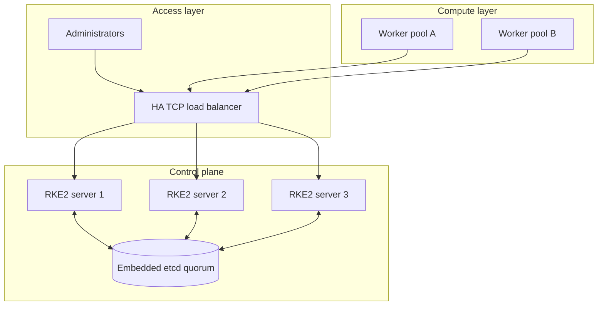
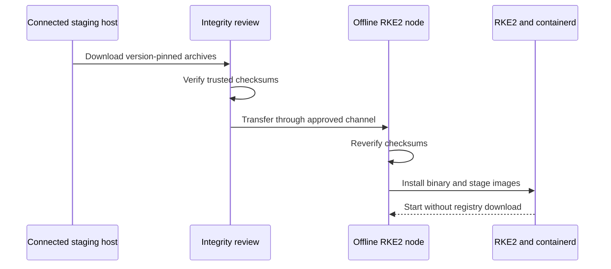

# Architecture

## Design summary

The source environment used three RKE2 server nodes and multiple agent nodes. The reusable configuration supports any odd server count and zero or more workers. Each server participates in embedded etcd and runs the Kubernetes control plane. A stable TCP endpoint fronts both the Kubernetes API and RKE2 registration service. A three-server design continues serving API requests after one server failure and retains etcd quorum after one etcd member fails.

## Traffic map

| Source | Destination | Port | Purpose |
|---|---|---:|---|
| Administrators and cluster clients | Load balancer | TCP 6443 | Kubernetes API |
| Joining servers and agents | Load balancer | TCP 9345 | RKE2 registration/supervisor |
| Server nodes | Server nodes | TCP 2379–2380 | etcd client and peer traffic |
| Cluster nodes | Server nodes | TCP 6443 | Kubernetes API |
| Server nodes | Cluster nodes | TCP 10250 | Kubelet API |
| Monitoring system | Authorized nodes | TCP 10249 | kube-proxy metrics |
| Monitoring system | Authorized components | Component-specific | Scheduler, controller-manager and etcd metrics |

This table is a design guide, not a universal firewall policy. RKE2 networking requirements vary by CNI, optional components and environment.

## Node roles

### Initial server

The initial server omits the `server:` setting and creates the first embedded-etcd member. It is special only during bootstrap; afterward it is an ordinary member of the etcd quorum.

### Joining servers

Joining servers use the stable registration endpoint and the same protected token. They must use compatible RKE2 configuration and matching critical cluster settings.

### Workers

Workers run `rke2-agent`, kubelet, containerd, kube-proxy and Canal components. They do not host embedded etcd or the API server.

## Air-gap artifact flow

The trusted checksum manifest must travel through a channel that is independent of the artifact when practical.

## Failure behavior

| Failure | Expected behavior | Operator action |
|---|---|---|
| One server fails | API remains available; etcd retains quorum | Repair or replace the member without restarting healthy servers |
| One worker fails | Workloads may reschedule if storage and policy allow | Diagnose, drain if reachable, repair and rejoin |
| Load-balancer member fails | VIP/service should remain available when LB itself is HA | Validate failover and remaining backend health |
| A majority of etcd members fail | Quorum is lost | Stop unsafe retries and invoke the tested recovery plan |
| Offline artifact corrupt | Installation or startup should fail validation | Reject the artifact and reacquire from trusted source |

## Storage boundary

RKE2’s embedded etcd protects Kubernetes state, not application volume data. Persistent-volume backup and recovery must be designed separately. Local-path storage also creates node affinity and recovery implications that should be documented per workload.

## Trust boundaries

- Administrative kubeconfig holders can control the cluster.
- RKE2 join-token holders can register nodes.
- etcd snapshot holders may recover Kubernetes objects, including Secrets.
- Metrics consumers receive operational data and should be authenticated or network-restricted.
- Offline artifact maintainers influence the software supply chain.
