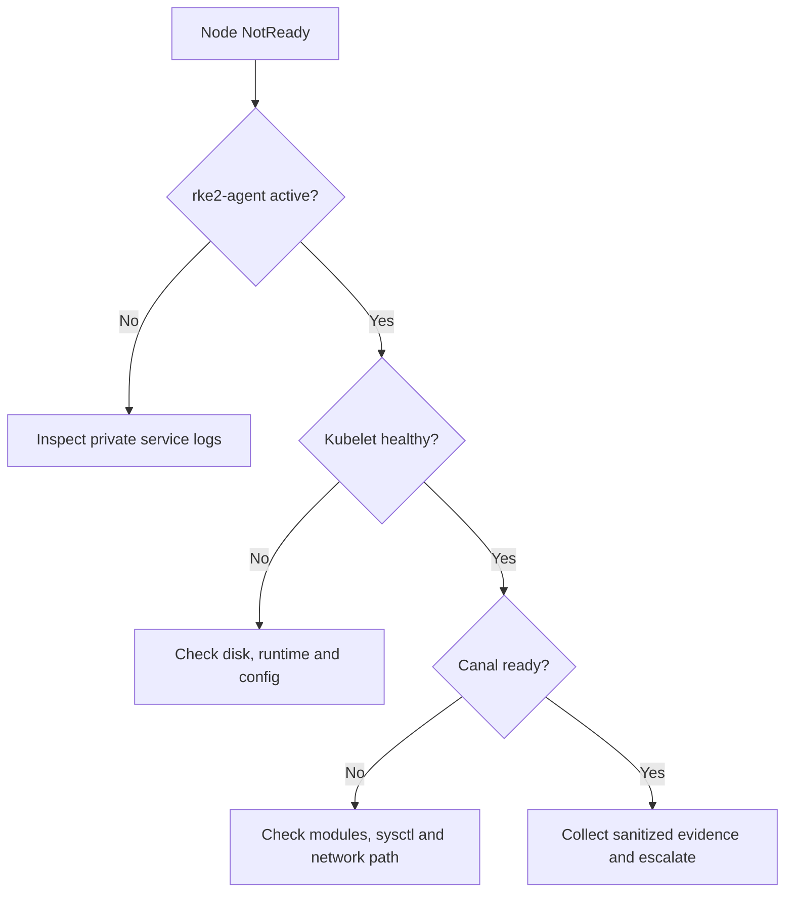

# Junior engineer scenario

## Mission

Deploy one non-production worker, verify it, diagnose a simulated readiness problem, and make a safe log-rotation change. Do not use a production cluster for this exercise.

## Part 1 — Prepare

1. Read the root README, security document and architecture document.
2. Confirm the server endpoint, approved node name and expected RKE2 version with a senior engineer.
3. Obtain the token through the approved secret process. Never paste it into chat, tickets or Git.
4. Stage and checksum the offline artifacts.
5. Copy `config/agent/config.example.yaml` to a protected location outside the repository.
6. Replace every placeholder.
7. Run `scripts/preflight-check.sh` and resolve all failures.

## Part 2 — Deploy and verify

1. Run `install-agent.sh` without `--apply`.
2. Ask for peer review of the resolved configuration and validation output.
3. Re-run with `--apply` during the approved window.
4. From a server node, confirm the new node becomes `Ready`.
5. Confirm Canal and kube-proxy pods run on the node.
6. Schedule an approved test workload and verify DNS and service connectivity.

## Part 3 — Troubleshoot a simulated failure

Assume the node remains `NotReady`.

Do not randomly restart every component or delete CNI state. Record evidence, change one variable at a time, and preserve rollback.

## Part 4 — Safely change log rotation

1. Open a change describing the old value, new value, risk and rollback.
2. Confirm disk capacity and logging requirements.
3. Update the protected node configuration outside the public repository.
4. Validate YAML and unresolved placeholders.
5. Drain the non-production worker.
6. Restart only that worker’s agent.
7. Confirm Ready state, system pods, test workload and logs.
8. Uncordon the node.
9. Record the result and whether rollback was required.

## Success criteria

- No secret entered Git or terminal output shared publicly.
- Preflight and dry validation succeeded before mutation.
- The worker joined and ran a test workload.
- Troubleshooting followed evidence instead of guesswork.
- The change included validation, rollback and documentation.
