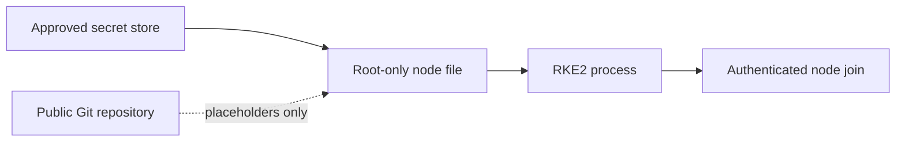

# Security architecture

## Protected assets

| Asset | Risk | Required treatment |
|---|---|---|
| RKE2 token | Unauthorized node registration | Secure distribution, mode `0600`, rotation after exposure |
| Administrative kubeconfig | Full cluster control | Minimal holders, secure workstation storage, never commit |
| TLS private keys | Service impersonation | Root-only storage and controlled rotation |
| etcd snapshots | Disclosure of full Kubernetes state | Encrypt, restrict, audit and retain securely |
| Registry credentials | Software supply-chain access | External secret store and least privilege |
| Audit logs | Sensitive operational evidence | Access controls, retention, integrity and secure forwarding |
| Offline artifacts | Cluster software supply chain | Pin versions and verify trusted signatures/checksums |

## Secret flow

Git contains only paths and placeholders. The secret store is authoritative for live values.

## Host hardening

- Restrict SSH and administrative access.
- Keep the OS and RKE2 within supported security-maintenance windows.
- Use consistent kernel modules and sysctl values.
- Restrict `/etc/rancher/rke2` and `/var/lib/rancher/rke2` permissions.
- Protect audit logs from unauthorized modification.
- Monitor disk capacity, especially `/var`.
- Disable unused standalone services; server nodes do not need `rke2-agent` enabled separately.

## Kubernetes controls requiring environment-specific design

This repository does not claim that the following are enabled in the source environment. They should be designed and verified separately:

- Least-privilege RBAC
- Pod Security Admission
- Default-deny and workload NetworkPolicies
- Secret encryption at rest
- Admission policy and image verification
- Namespace tenancy controls
- Runtime detection and compliance scanning

## Publication controls

Before public release:

1. Scan current files with Gitleaks or an equivalent scanner.
2. Search for IPs, domains, email addresses, hostnames and company names.
3. Inspect certificate and archive filenames.
4. Review Git history, not just the working tree.
5. Rotate secrets if exposure cannot be ruled out.
6. Have a second person review the repository.

`.gitignore` prevents future additions; it does not remove committed history.
