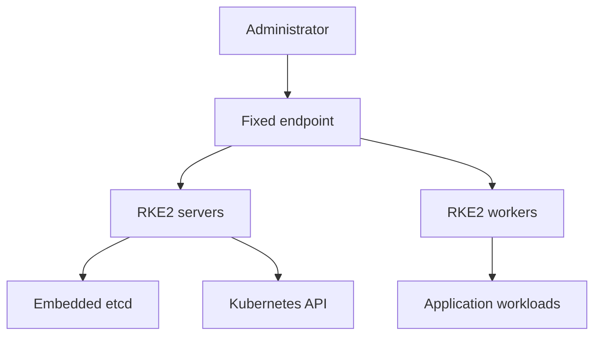

# Start here: RKE2 for junior DevOps engineers

This page explains the project before you run commands. Read it once, complete the deployment worksheet, and then follow the [quick start](quickstart.md).

## What this repository builds

RKE2 is a Kubernetes distribution designed for security-conscious environments. This project builds a highly available cluster that can operate without direct internet access.

## Components in plain language

| Component | Simple explanation |
|---|---|
| RKE2 server | Runs the Kubernetes control plane. It can also run workloads unless it is tainted |
| RKE2 worker/agent | Runs application pods but does not participate in the etcd control-plane quorum |
| Embedded etcd | Stores Kubernetes cluster state, including sensitive Kubernetes objects |
| Fixed endpoint | A stable IP or DNS name in front of the servers |
| HAProxy/load balancer | Sends registration and API connections to healthy servers |
| CNI | Provides pod networking. This repository uses Canal |
| Join token | A shared secret that authorizes a node to join the cluster |
| TLS SAN | An IP address or DNS name that the Kubernetes API certificate must accept |
| Air-gap artifacts | RKE2 binaries and container images transferred from a trusted connected system |

## Server count and quorum

Use an odd number of servers for embedded etcd. Three servers are the normal HA starting point.

| Servers | Quorum | Server failures tolerated | Suitable use |
|---:|---:|---:|---|
| 1 | 1 | 0 | Lab only; no control-plane HA |
| 3 | 2 | 1 | Recommended starting point |
| 5 | 3 | 2 | Larger environments with a justified operational need |

Adding a fourth server does not improve failure tolerance over three servers. Add servers one at a time and confirm cluster health after each join.

Workers are different: use zero or more workers based on workload capacity. Server nodes are schedulable by default, so a small HA cluster can technically run with three servers and no workers.

## Why two ports are required

| Port | Used for | Direction |
|---:|---|---|
| `9345/TCP` | RKE2 node registration and supervisor traffic | Joining servers/workers to the fixed endpoint |
| `6443/TCP` | Kubernetes API | Administrators, components and clients to the fixed endpoint |

The load balancer must forward both ports to every RKE2 server. See [Load-balancer setup](load-balancer.md).

## IP endpoint versus DNS

DNS is optional.

- If you use only a VIP or fixed IP, add that IP to `tls-san`.
- If you use DNS, add the DNS name to `tls-san` on every server.
- If clients use both IP and DNS, include both.
- Never add a DNS name that does not exist.
- Workers need the registration endpoint, but they do not need `tls-san` settings.

## What each installation role means

| Role | Run on | Important behavior |
|---|---|---|
| `init` | First server only | Does not contain `server:`; creates the initial cluster |
| `join` | Every later server | Uses `server:` to join through the fixed endpoint |
| `agent` | Every worker | Joins as a workload node and does not run etcd |

Do not start multiple `init` nodes. They would create separate clusters.

## Deployment worksheet

Decide these values before installation:

| Decision | Your value | Required? |
|---|---|---|
| RKE2 version | `________________` | Yes |
| CPU architecture | `amd64` / `arm64` | Yes |
| Fixed endpoint IP or DNS | `________________` | Yes |
| Optional additional DNS SAN | `________________` | No |
| Number of servers | `________________` | Yes; odd for HA |
| Number of workers | `________________` | No |
| Pod CIDR | RKE2 default or `________________` | Only if customized |
| Service CIDR | RKE2 default or `________________` | Only if customized |
| Token delivery method | `________________` | Yes |
| Artifact checksum source | `________________` | Yes |
| Snapshot destination | `________________` | Yes for production |

## Safe learning path

1. Read this page and [Architecture](architecture.md).
2. Complete the worksheet.
3. Configure and test the [load balancer](load-balancer.md).
4. Review the [configuration reference](configuration-reference.md).
5. Follow the [lab deployment](lab-deployment.md) in a non-production environment.
6. Use the [quick start](quickstart.md) for the real approved environment.
7. Validate every node before adding another.
8. Learn the [operations](operations.md), [backup](backup-and-recovery.md), and [troubleshooting](troubleshooting.md) procedures.

## Stop conditions

Stop and investigate if any of these occur:

- Artifact checksum verification fails.
- The token file is missing or readable by non-root users.
- The fixed endpoint cannot reach `9345`.
- An existing server is unhealthy before another server is added.
- A joining server reports a critical configuration mismatch.
- etcd loses quorum.
- A node remains `NotReady` after the expected initialization period.

Never continue adding nodes to hide an unhealthy cluster.
